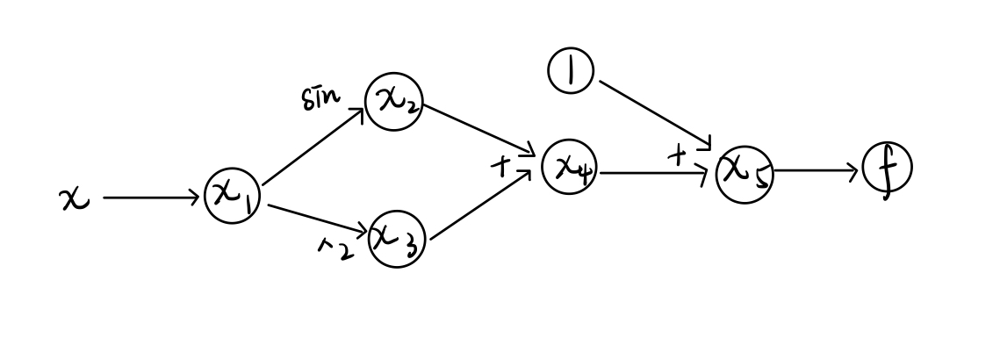

# Introduction

Derivative: $f'(x)=\lim _{h\to 0}{\frac {f(x+h)-f(x)}{h}}$

As a branch of calculus, differentiation is one of the most important and useful topics in mathematics and other applied sciences and engineering. There are some common methods of computing derivatives, such as Newton's Method and Finite-difference Method. While these methods have deficiencies like unstability and low accuracy, our automatic differentiation SPLADTool will compute derivatives to machine precision with less cost compare to other mthods. 

# Background

To help users better understand how automatic differentiation works, we will briefly explain some crucial background concepts applied in the calculations of automatic differentiation:

### 1. Jacobian Matrix

Jacobian Matrix is an important concept in vector calculus, and it also helps us to understand the calculations in the automatic differentitaion.

Given a fucntion $h: R^n -> R^m$, the Jacobian matrix of h is as follows:

<center> $$J  =  {\begin{bmatrix}{\dfrac {\partial h_1}{\partial x_1}}&\cdots &{\dfrac {\partial h_{1}}{\partial x_{n}}}\\\vdots &\ddots &\vdots \\{\dfrac {\partial h_{m}}{\partial x_{1}}}&\cdots &{\dfrac {\partial h_{m}}{\partial x_{n}}}\end{bmatrix}}$$

### 3. Chain Rule

Chain rule is the most important concepts in Automatic Differentiation.
Given a function like $h(u(t))$, where $t \in R$, to compute the derivative of function $h$ with respect to $t$, we need to apply chain rule:

<center>$$\dfrac{dh}{dt} = \dfrac{\partial h}{\partial u}\dfrac{du}{dt}$$

In more general cases, consider functions like $h(u(x), v(x))$, where $x \in R^m$. Regarding vector calculaus, in order to get the derivative of function $h$ with respect to $x$, we introduce the gradient operator $\nabla$ into our chain rule:

<center>$$\nabla_x h = \dfrac{\partial h}{\partial u}\nabla u + \dfrac{\partial h}{\partial v}\nabla v$$

To summarize, given $h(y(t)): R^n -> R^m$ , where $y(x) = [y_1(x),...,y_n(x)]^T$ and $x \in R^m$, the general chain rule is as follows:

<center>$$\nabla_x h = \sum_{i=1}^{n} \dfrac{\partial h}{\partial y_i}\nabla y_i(x)$$

### 4. Graph Structures

#### (i) Forward Mode

We will use a simple function, $f(x) = sin(x) + x^2 + 1$ (evaluate at $x = 1$), as an example to illustarte the graph structure of calculations:
We break down the function into several elementary functions. At each node, i.e $x_i$, we only calculate one elementary operation, its corresponding derivtive and their corresponding values, which are very easy to calculate.

| trace | elementary operation |   current value      | elementary derivative | $\nabla_x$  current value |
|-------|----------------------|---------------------|-----------------------|-----------------------|
|$x_1$  | $x$                  | 1     | $\dot{x}$                   | 1 |
|$x_2$| $sin(x)$ | $sin(1)$ | $cos(x)\dot{x}$| $cos(1)$|
|$x_3$| $x^2$ | 1 | $2x\dot{x}$ | 2|
|$x_4$| $x_2 + x_3$ | $sin(1) + 1$ | $cos(x)\dot{x} + \dot{x}$ | $cos(1) + 1$|
|$x_5$| $x_4 + 1$ | $sin(1) + 2$ | $cos(x)\dot{x} + \dot{x}$ | $cos(1) + 2$|
|$f$| $x_4 + 1$ | $sin(1) + 2$ | $cos(x)\dot{x} + \dot{x}$ | $cos(1) + 2$|

The graph structure of our example is as follows: 
Each node in the graph corresponds to a trace in the table above, and each arrow represents a single elementary operation.

(If image is not shown, please right click and choose "Open Image in New Tab")



When we have multiple input varibales and multiple output functions, we need to break the function into more elementary functions. The graph structure of calculations will be more complicated, but the steps of drawing the graph are basically the same.

#### (ii) Reverse Mode (optional)

### 5. Dual Numbers

The dual numbers, $ z = a + b\epsilon$, (where $ a, b \in R$ and $\epsilon^2 = 0, \epsilon \neq 0$), has nice properties which be help us to do the calculations in forward mode automatic differentiation. For example, dual numbers can be used as a data structure which can carry both the primal trace (real part) and the tangent trace (dual part) simaltaneously.

### 6. Elementary Functions

The power of automatic differentiation is that we can divide the complicated functions into many elementary functions, which are much easier to take derivative and do calculation. In the example above, we divided function $f(x)$ into $sin$, square, and addition, which are all elementary functions.

# How to Use SPLADTool

Here is a demo we used to test our automatic differentiation:


```python
import unittest
import spladtool_forward as st
import numpy as np


class TestArithmeticForward(unittest.TestCase):
    def test_arithmetic1(self):
    
        # Initialize input matrix x
        x = st.tensor([[1., 2.], [3., 4.]])
        
        # Define output functions y(x) and z(x)
        y = 2 * x + 1
        z = - y / (x ** 3)
        
        # Print out the values calculated by our forward mode automatic differentiation SPLADTool
        print('x : ', x)
        print('y : ', y)
        print('y.grad : ', y.grad)
        print('z: ', z)
        print('z.grad: ', z.grad)
        
        # Check if the values above are cosistent with values calculated by hand
        self.assertTrue((y.data == np.array([[3., 5.], [7., 9.]])).all())
        self.assertTrue((y.grad == np.array([[2., 2.], [2., 2.]])).all())
        self.assertTrue((z.data == np.array([[-3., -5. / 8], [-7. / 27, -9. / 64]])).all())
        self.assertTrue((z.grad == np.array([[7., 11./16], [15. / 81, 19. / 256]])).all())


if __name__ == '__main__':
    unittest.main()
```


```python

```


```python

```
